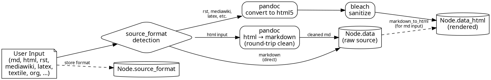
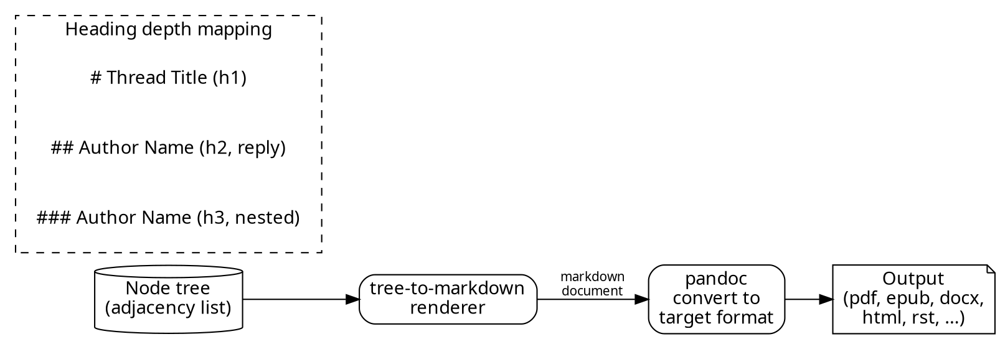
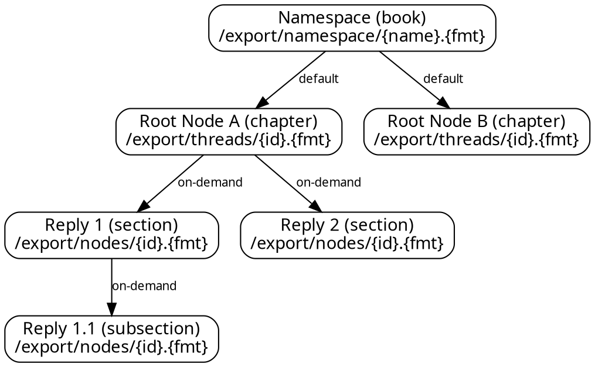
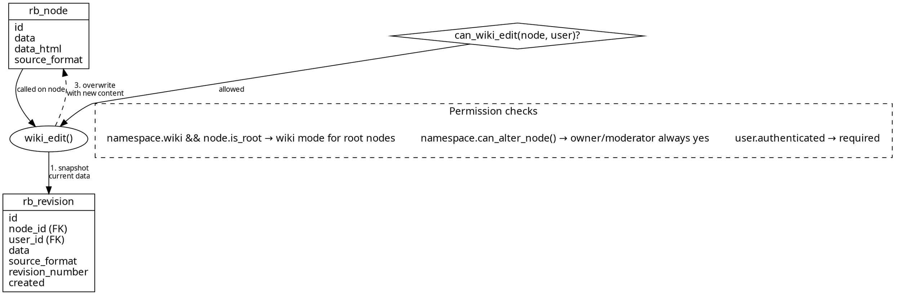
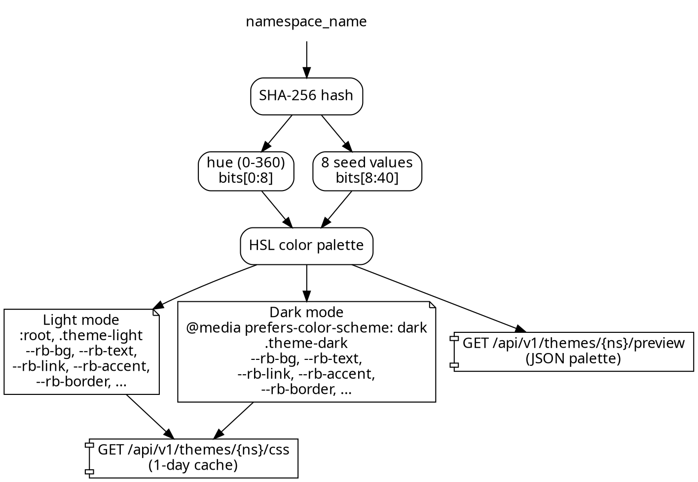
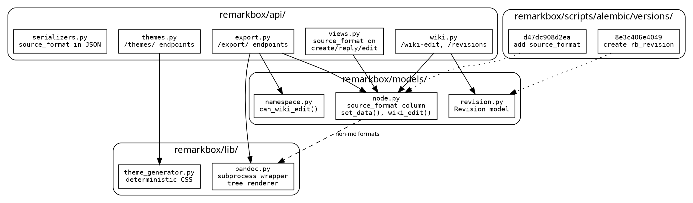

# Operation Undigg — Architecture

Document-first platform: every namespace is a book, every thread is a chapter,
every reply is a section. Pandoc renders 67 output formats.

## Data Flow — Write Path

## Data Flow — Read / Export Path

## Export Hierarchy

67 output formats including: markdown, html5, pdf, epub, docx, odt, rst,
latex, mediawiki, man, plain, rtf, asciidoc, textile, org, json, and more.

## Wiki Mode

## Auto-Generated Themes

Deterministic: same namespace name always produces the same theme.

## Module Map

