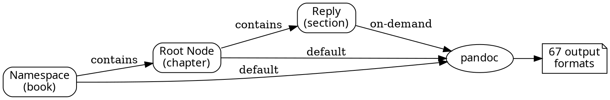

# T15: Operation Undigg — Pandoc Export & Wiki Mode

**Status**: resolved
**Priority**: high
**Source**: fox directive 2026-03-09
**Resolved**: 2026-03-10 (`6d1cfff`)

## Summary

Transform remarkbox into a document-first platform. Every namespace is a book,
every root thread is a chapter. Pandoc renders every format it can produce.
Wiki mode lets anyone edit root topics with revision tracking.

## Architecture



### Data model changes

1. **Node.source_format** — `Unicode(16)`, default `'markdown'`. Tracks what
   syntax the user wrote in (markdown, html, rst, mediawiki, latex, textile, etc).
   Pandoc input formats map directly.

2. **rb_revision** — new table for wiki mode edit history.
   - `id` (UUIDType, PK)
   - `node_id` (FK → Node)
   - `user_id` (FK → User)
   - `data` (UnicodeText) — raw source at time of edit
   - `source_format` (Unicode(16))
   - `created` (BigInteger) — timestamp
   - `revision_number` (Integer) — sequential per node

3. **Namespace.wiki** — already exists (`Boolean, default=False`), needs
   implementation. When True, any authenticated user can edit the root node
   of any thread. Each edit creates a revision.

### Export pipeline

Pandoc subprocess. Input = markdown/rst/html/whatever `source_format` says.
Output = every format pandoc supports.

**Default generated (cached on write/edit):**
- Namespace level: one document per namespace containing all root threads
- Root node level: one document per root thread

**On-demand (generated per request):**
- Any node or subthread at any depth

**Pandoc output formats** (67 total, subset for default generation):
- markdown, gfm, commonmark, html5, pdf, epub, docx, odt, rst,
  mediawiki, latex, man, plain, rtf, asciidoc, textile, org, json

**URI scheme:**
```
/api/v1/export/namespace/{name}.{format}     — full book
/api/v1/export/threads/{node_id}.{format}    — single chapter
/api/v1/export/nodes/{node_id}.{format}      — on-demand subthread
```

### Content ingestion

On write (create thread, reply, edit):
1. Accept `source_format` parameter (default: `markdown`)
2. If HTML input, strip to clean body (no head/script/style)
3. Store raw source in `Node.data` with `Node.source_format`
4. Render to HTML via pandoc: `pandoc -f {source_format} -t html5`
5. Sanitize HTML output through existing bleach pipeline
6. Store in `Node.data_html`

### Wiki mode

When `Namespace.wiki = True`:
- Any authenticated user can edit root nodes (not just owner/moderator)
- Each edit stores a revision in `rb_revision` before overwriting
- Root node always has the latest version (fast render)
- Revision history accessible via API
- Diff between revisions on-demand

### Progressive enhancement

Export menus work without JS (plain links to format URIs).
With JS: dropdown/popover with format picker, async download.

## Phases

### Phase 1: Export pipeline (pandoc integration)
- [x] Tree-to-markdown renderer (walk node tree → single markdown document)
- [x] Export API endpoints (namespace, thread, node)
- [x] Pandoc subprocess wrapper
- [x] Format negotiation (URI suffix)

### Phase 2: Multi-syntax input
- [x] Add `source_format` column to Node
- [x] Alembic migration (`d47dc908d2ea`)
- [x] Modify `set_data()` to use pandoc for non-markdown formats
- [x] Accept `source_format` on create/reply/edit API endpoints
- [x] HTML stripping for HTML input (pandoc html→markdown round-trip)

### Phase 3: Wiki mode + revisions
- [x] Create `rb_revision` model + migration (`8e3c406e4049`)
- [x] Implement wiki edit permissions in Namespace (`can_wiki_edit()`)
- [x] Store revisions on edit (`node.wiki_edit()`)
- [x] Revision history API endpoint
- [x] Diff endpoint (`GET /api/v1/revisions/{id}/diff/{other_id}`)

### Phase 4: Auto-generated themes
- [x] Per-namespace theme generation (light + dark)
- [x] CSS custom properties for theming (`--rb-*`)
- [x] Theme preview (JSON palette)

## Test Coverage

95 new tests across 4 test files (544 total):

| File | Tests | Coverage |
|------|-------|----------|
| `test_pandoc.py` | 33 | pandoc convert, formats, tree render, namespace render |
| `test_theme_generator.py` | 15 | hue, seed, CSS generation, light/dark mode |
| `test_revision.py` | 11 | Revision model, wiki edit permissions |
| `test_undigg.py` | 34 | integration tests for export, wiki, themes, multi-syntax |

Module coverage: 76% on new code (100% on themes, serializers; 80% pandoc; 72% export; 55% wiki).

## Notes

- Pandoc 3.1.3 installed at `/usr/bin/pandoc`
- 43 input formats, 67 output formats
- PDF via `wkhtmltopdf` (no pdflatex)
- `Namespace.wiki` column already existed in schema
- Diff endpoint deferred — revision data is stored, diffing can be added later
